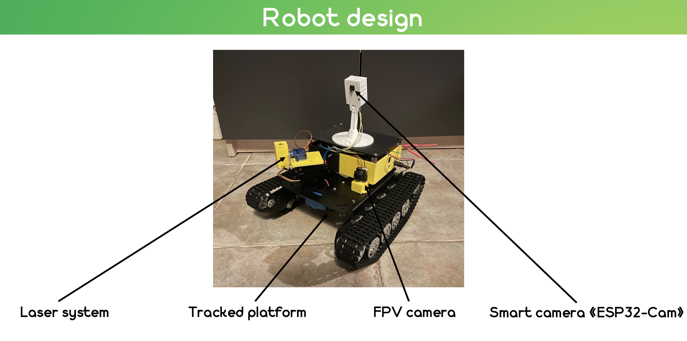
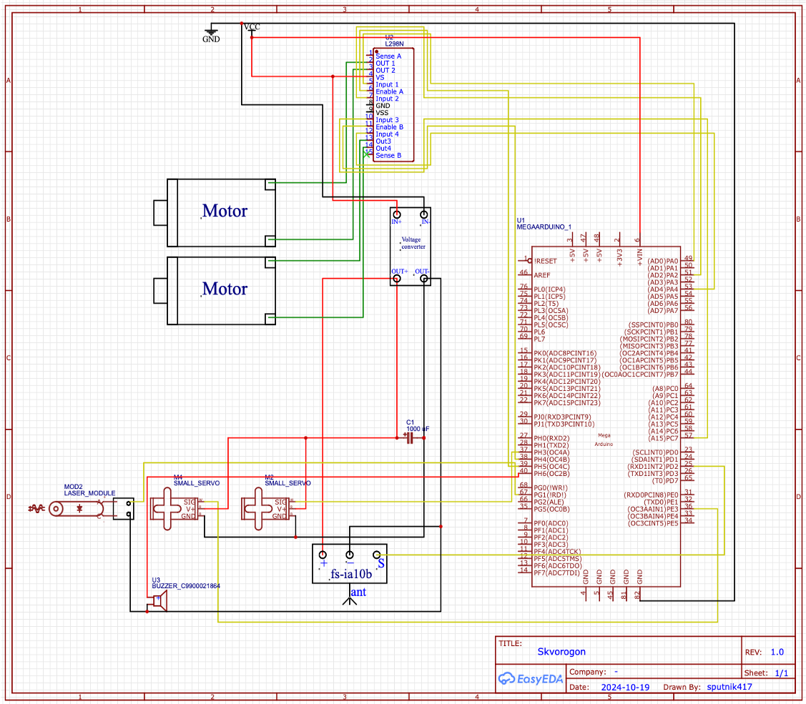
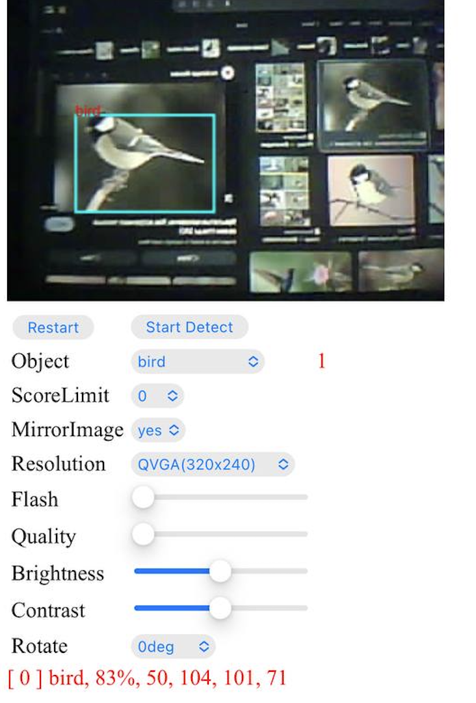
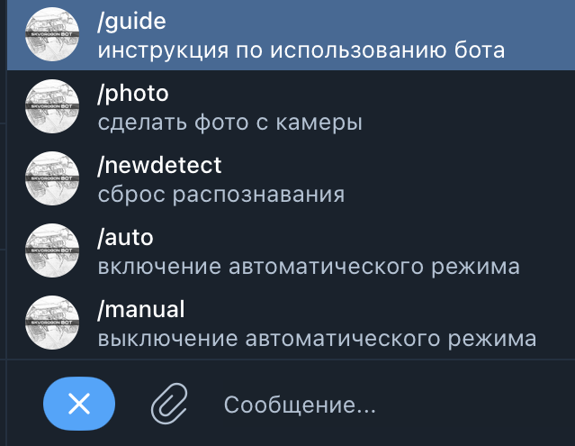

# Skvorogon: Automatic bird repeller

An autonomous robot has been developed to disperse birds in cowsheds.
The robot must drive through the center of the cowshed using all the scaring systems. Namely, to conduct laser beams at bird concentrations, feed and farms located above the cows' heads.

The operator can take control using the FPV camera and remote control, or switch to automatic operation mode both from the remote control and from the telegram bot.

In the absence of an operator, the robot is able to independently recognize the bird in front of it and turn on the appropriate operating mode.

Also, a person on the farm can control the work process using a web page. Otherwise, anyone with access to the Internet can evaluate the process of performing the work performed by the robot.

## Robot equipment
  - Battery
  - Tracked platform
  - Arduino Mega
  - L298N motor driver
  - FS-IA10B radio receiver
  - Flysky i6 transmitter
  - LM2596S step-down voltage regulator
  - MG996R servo motor
  - Buzzer module
  - Laser emitter
  - Caddx FPV camera with transmitter
  - SG90 servo motor
  - ESP32 AI-Thinker

## Electrical diagram

## ESP32
An ESP32 Cam was installed on the robot to automatically locate birds, as well as control them via the Internet.

### Web page

### Telegram bot

